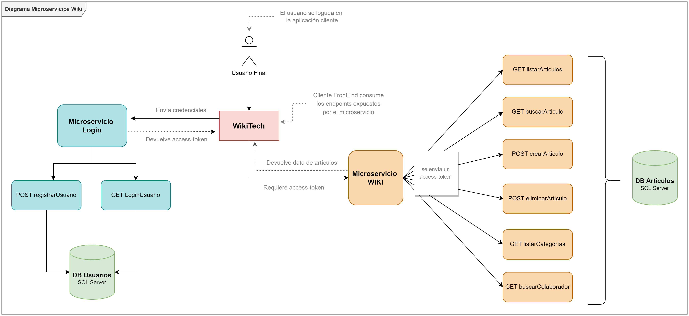

##  Microservicio - WIKI

Este microservicio tiene como finalidad exponer diferentes servicios para el funcionamiento de una Wiki de artículos relacionados con la tecnología. El mismo es consumible por cualquier cliente Web. 
La Wiki tendrá un formato colaborativo.

### Diagrama de Arquitectura

#### Collection de Postman

Se disponibiliza el link de la collection con los servicios que se exponen: https://www.getpostman.com/collections/04827ab751db1cf22be7
